<!-- ═══════════════════════════════════════════════════════════════════ -->
<!--  🏦  LendScope — Bank Loan & Card Portfolio Analytics — FY2026      -->
<!-- ═══════════════════════════════════════════════════════════════════ -->

<div align="center">

<!-- Animated typing header -->


<br/>

<!-- Shield badges -->
<p>
  
  
  
  
  
  
</p>

<p>
  
  
  
  
  
  
</p>

<!-- Animated rainbow divider -->


<h3>
  🏦 <b>LendScope</b> — a unified analytics platform for retail bank<br/>
  <b>loan and card portfolios</b>. From raw transactional data to executive insight,<br/>
  built on <b>Python (Pandas + Plotly)</b> for visual analytics and <b>PostgreSQL</b> for business-question reporting.
</h3>

</div>

---

## 📑 Table of Contents

<details open>
<summary><b>Click to expand / collapse</b></summary>

- [🎯 Project Overview](#-project-overview)
- [📊 Executive Scorecard](#-executive-scorecard)
- [🗂️ Repository Structure](#️-repository-structure)
- [🧰 Tech Stack](#-tech-stack)
- [🚀 Getting Started](#-getting-started)
- [🧩 Data Model](#-data-model)
- [📈 Visual Analytics (Python)](#-visual-analytics-python)
- [❓ Business Questions & Answers (SQL)](#-business-questions--answers-sql)
  - [Section A — Core Loan KPIs](#section-a--core-loan-kpis)
  - [Section B — Good vs Bad Loans](#section-b--good-loan-vs-bad-loan-kpis)
  - [Section C — Visualization Support](#section-c--visualization-support-brd2)
  - [Section D — Card Business Questions](#section-d--credit--debit-card-business-questions)
  - [Section E — Cross-Product Risk & Value](#section-e--cross-product-risk--customer-value)
- [🔍 Key Findings](#-key-findings)
- [💡 Recommended Actions](#-recommended-actions)
- [🗺️ Roadmap](#️-roadmap)
- [📜 License](#-license)

</details>

---

## 🎯 Project Overview

<div align="center">

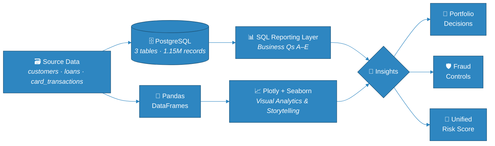

</div>

**LendScope** is a full-year **FY2026 analytics engagement** for a mid-sized retail bank. It blends a **loan book** (250 K applications) with a **card transaction book** (750 K transactions) and delivers insight across two complementary tracks:

| Track | Deliverable | Purpose |
|---|---|---|
| 🐍 **Visual Analytics (Python)** | `LendScope_FY2026_Analysis.ipynb` | Interactive charts, trend storytelling, cross-product risk narratives for business stakeholders |
| 🐘 **Reporting Layer (PostgreSQL)** | `sql/03_business_questions.sql` | Production-ready SQL queries powering BI dashboards and scheduled reports |

Together they cover **32 business questions** spanning core loan KPIs, portfolio quality, regional and segment behaviour, card fraud, and unified customer value.

---

## 📊 Executive Scorecard

<div align="center">

### 🏦 Loan Book — FY2026

| KPI | Value | KPI | Value |
|:---|:---:|:---|:---:|
| 📝 Total Applications | **250,000** | 💵 Total Funded | **$2,647.91 M** |
| 📥 Amount Received | **$537.39 M** | 📈 Avg Interest Rate | **11.95 %** |
| ⚖️ Avg DTI | **19.04 %** | ✅ Good Loans | **87.60 %** |
| ⛔ Charged Off | **12.40 %** | 📆 MTD Applications | **24,929** |

### 💳 Card Book — FY2026

| KPI | Value | KPI | Value |
|:---|:---:|:---|:---:|
| 🛒 Purchase Volume | **$69.66 M** | 🧾 Transactions | **638,408** |
| 🚨 Fraud Rate | **0.439 %** | 💸 Fraud Exposure | **$524,529** |
| 🟦 Credit Card Spend | **$38.43 M** | 🟨 Debit Card Spend | **$31.23 M** |
| 🎯 Avg Ticket Size | **~$109** | 🌐 Top Fraud Channel | **ONLINE** |

</div>

---

## 🗂️ Repository Structure

```text
🏦 lendscope/
│
├── 📄 README.md                              ← you are here
├── 📄 .gitignore
├── 📄 requirements.txt
│
├── 📂 data/
│   ├── 📊 customers.csv                      ← 150,000 records · 13 columns
│   ├── 📊 loans.csv                          ← 250,000 records · 27 columns
│   └── 📊 card_transactions.csv              ← 750,000 records · 14 columns
│
├── 📂 sql/
│   ├── 🗄️ 01_schema.sql                      ← tables + indexes
│   ├── 📥 02_load_data.sql                   ← \copy from CSV
│   └── ❓ 03_business_questions.sql          ← all 32 queries (A–E)
│
├── 📂 notebooks/
│   └── 🐍 LendScope_FY2026_Analysis.ipynb    ← visual analytics & storytelling
│
└── 📂 reports/
    └── 📈 figures/                           ← exported chart PNGs
        ├── 🖼️ good_vs_bad_loans.png
        ├── 🖼️ charge_off_by_grade.png
        ├── 🖼️ monthly_trend.png
        ├── 🖼️ top_states_funded.png
        ├── 🖼️ loan_term_distribution.png
        ├── 🖼️ employment_length.png
        ├── 🖼️ loan_purpose.png
        ├── 🖼️ home_ownership_treemap.png
        ├── 🖼️ card_spend_by_type.png
        ├── 🖼️ monthly_card_spend.png
        ├── 🖼️ merchant_categories.png
        ├── 🖼️ fraud_by_channel.png
        └── 🖼️ score_band_risk.png
```

<div align="center">
  
</div>

## 🧰 Tech Stack

<div align="center">

| Layer | Technology | Why |
|:---|:---|:---|
| 🐍 Language | **Python 3.13** | Primary analytics language |
| 🐼 Data wrangling | **pandas 3.0 · numpy 2.5** | Fast columnar ops on 1.15 M records |
| 📊 Static charts | **matplotlib 3.11 · seaborn 0.13** | Publication-ready figures |
| 🌐 Interactive charts | **plotly 7.1** | Dashboards + hover drill-down |
| 🗄️ Database | **PostgreSQL 16** | Reporting layer, indexing, scheduled queries |
| 📓 Notebook | **Jupyter** | Narrative + reproducible visual analytics |

</div>

---

## 🚀 Getting Started

### 1️⃣ Clone & Install

```bash
git clone https://github.com/<your-username>/lendscope.git
cd lendscope

python -m venv .venv
source .venv/bin/activate      # Windows: .venv\Scripts\activate
pip install -r requirements.txt
```

### 2️⃣ Set Up the PostgreSQL Reporting Layer

```bash
createdb lendscope
psql -U postgres -d lendscope -f sql/01_schema.sql
psql -U postgres -d lendscope -f sql/02_load_data.sql
psql -U postgres -d lendscope -f sql/03_business_questions.sql
```

> ⚠️ `\copy` is a **psql client-side** meta-command — run via `psql`, not a generic SQL runner.

### 3️⃣ Run the Visual Analytics Notebook

```bash
jupyter notebook notebooks/LendScope_FY2026_Analysis.ipynb
```

---

## 🧩 Data Model

<div align="center">

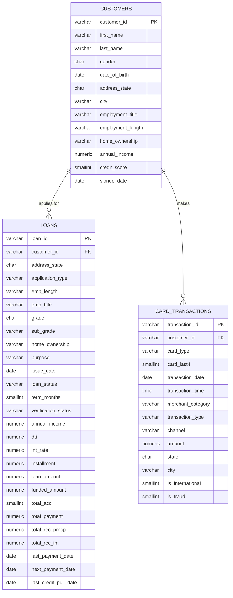

</div>

---

## 📈 Visual Analytics (Python)

The Jupyter notebook `LendScope_FY2026_Analysis.ipynb` is the **storytelling layer** of the project — where data becomes decisions. It focuses on:

- 📉 **Time-series trend analysis** — monthly origination, funded vs. received, card-spend seasonality
- 🗺️ **Regional and segment heat-maps** — state-level funded volume, employment-tenure risk, home-ownership mix
- 🎯 **Interactive Plotly dashboards** — hover drill-downs across grades, purposes, and merchant categories
- 🧠 **Cross-product risk narrative** — how credit score correlates with both default and fraud
- 💎 **Customer-value views** — 360° relationship snapshots for VIP identification

Below is a snapshot of the visual library included in the notebook:

| Chart | Type | Interactive |
|:---|:---:|:---:|
| Charge-Off Rate by Credit Grade | Bar + colour scale | ✅ Plotly |
| Monthly Funded vs. Received | Dual-line | ✅ Plotly |
| Monthly Applications Trend | Area | ✅ Plotly |
| Top 15 States by Funded Amount | Bar + heat colour | ✅ Plotly |
| Loan Term Distribution | Donut | ✅ Plotly |
| Applications by Employment Length | Bar + heat colour | ✅ Plotly |
| Funded Amount by Loan Purpose | Bar (ranked) | ✅ Plotly |
| Home Ownership Breakdown | Treemap | ✅ Plotly |
| Credit vs. Debit Spend | Donut | ✅ Plotly |
| Monthly Card Spend by Type | Multi-line | ✅ Plotly |
| Merchant Category Spend | Bar (ranked) | ✅ Plotly |
| Fraud Rate by Channel × Card | Grouped bar | ✅ Plotly |
| Credit Score Band vs. Risk | Dual-axis bar | ⚡ Matplotlib |

---

## ❓ Business Questions & Answers (SQL)

The SQL reporting layer in [`sql/03_business_questions.sql`](sql/03_business_questions.sql) is the **BI-ready** component of LendScope — designed to be dropped into any dashboard tool (Power BI, Tableau, Metabase, Looker) or scheduled reporting job.

Each query is indexed, parameterisable, and written for readability with dashboard-ready output columns.

---

### Section A — Core Loan KPIs

<details open>
<summary><b>A1–A6 · Totals, MTD, Averages</b></summary>

#### 🅰️ A1 · Total Loan Applications & MTD

```sql
SELECT COUNT(*) AS total_applications FROM loans;

SELECT COUNT(*) AS mtd_applications
FROM loans
WHERE date_trunc('month', issue_date) =
      (SELECT date_trunc('month', MAX(issue_date)) FROM loans);
```

<div align="center">

| Metric | Value |
|:---|:---:|
| 📝 Total Applications | **250,000** |
| 📆 MTD Applications | **24,929** |

</div>

#### 🅰️ A2 · Total & MTD Funded Amount

| Metric | Value |
|:---|:---:|
| 💵 Total Funded | **$2,647,905,650** |
| 📆 MTD Funded | **$264,799,500** |

#### 🅰️ A3 · Total & MTD Amount Received

| Metric | Value |
|:---|:---:|
| 📥 Total Received | **$537,388,700** |
| 📆 MTD Received | **$19,179,081** |

> 💡 The Received / Funded ratio is only **20.3 %** — the portfolio is *young*. Most FY2026 vintage loans are still **Current**, not yet Fully Paid.

#### 🅰️ A4 · Average Interest Rate

> **11.95 %** — weighted across all grades, reflects healthy pricing.

#### 🅰️ A5 · Average DTI

> **19.04 %** — comfortably under the typical 36 % retail-lending ceiling.

#### 🅰️ A6 · One-Shot KPI Scorecard

```sql
SELECT
    COUNT(*)                        AS total_applications,
    ROUND(SUM(funded_amount),2)     AS total_funded_amount,
    ROUND(SUM(total_payment),2)     AS total_amount_received,
    ROUND(AVG(int_rate)*100,2)      AS avg_interest_rate_pct,
    ROUND(AVG(dti)*100,2)           AS avg_dti_pct
FROM loans;
```

</details>

---

### Section B — Good Loan vs Bad Loan KPIs

<details open>
<summary><b>B1–B3 · Bucketing, Net Gain/Loss, Grade Risk</b></summary>

#### 🅱️ B1 · Good vs Bad — Application Share

```sql
SELECT
  CASE WHEN loan_status IN ('Fully Paid','Current') THEN 'Good Loan' ELSE 'Bad Loan' END AS bucket,
  COUNT(*) AS n,
  ROUND(100.0*COUNT(*)/SUM(COUNT(*)) OVER (), 2) AS pct
FROM loans GROUP BY 1;
```

<div align="center">

| Bucket | Applications | Share |
|:---|:---:|:---:|
| ✅ **Good Loan** (Fully Paid + Current) | 218,996 | **87.60 %** |
| ⛔ **Bad Loan** (Charged Off) | 31,004 | **12.40 %** |

</div>

#### 🅱️ B2 · Funded vs Received by Bucket

| Bucket | Funded | Received | Net |
|:---|:---:|:---:|:---:|
| ✅ Good | $2,317.71 M | $516.56 M | **+$516.56 M** |
| ⛔ Bad | $330.19 M | $20.83 M | **+$20.83 M** |

> 📸 **Chart — Good vs. Bad Loan Split**
>
> 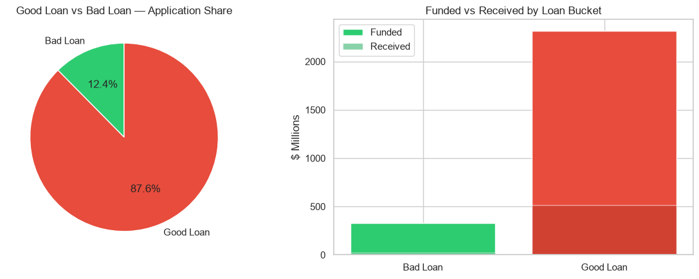
>
> *Two-panel figure: pie chart showing application share (87.6% good / 12.4% bad) alongside a grouped bar chart comparing funded vs received amounts by loan bucket.*

#### 🅱️ B3 · Charge-Off Rate by Credit Grade

<div align="center">

| Grade | Total Loans | Charge-Off Rate | Avg Interest Rate |
|:---:|:---:|:---:|:---:|
| 🟢 **A** | 39,809 | **3.07 %** | 6.30 % |
| 🟢 **B** | 60,088 | **6.10 %** | 8.60 % |
| 🟡 **C** | 64,937 | **11.07 %** | 11.50 % |
| 🟠 **D** | 45,208 | **17.08 %** | 14.81 % |
| 🔴 **E** | 25,024 | **23.92 %** | 18.20 % |
| 🔴 **F** | 9,959 | **32.30 %** | 21.90 % |
| 🔴 **G** | 4,975 | **40.30 %** | 25.92 % |

</div>

> 📸 **Chart — Charge-Off Rate by Credit Grade**
>
> 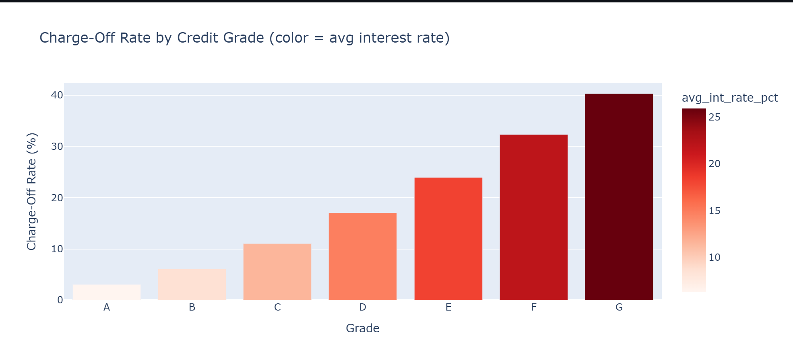
>
> *Vertical bar chart with grades A → G on the x-axis and charge-off rate on the y-axis. Bar colour encodes average interest rate (light → dark red), showing pricing tracks risk closely.*

**✅ Insight:** Grade is **well-calibrated** — every grade step costs ~5 pp of charge-off, and pricing (interest rate) tracks it closely.

</details>

---

### Section C — Visualization Support (BRD2)

<details open>
<summary><b>C1–C6 · Trend, Region, Term, Employment, Purpose, Home Ownership</b></summary>

#### 🅲 C1 · Monthly Trend of Applications / Funded / Received

```sql
SELECT
    date_trunc('month', issue_date)::date AS issue_month,
    COUNT(*)                              AS applications,
    ROUND(SUM(funded_amount), 2)          AS funded_amount,
    ROUND(SUM(total_payment), 2)          AS amount_received
FROM loans
GROUP BY 1
ORDER BY 1;
```

> 📸 **Chart — Monthly Funded vs Amount Received (2026)**
>
> 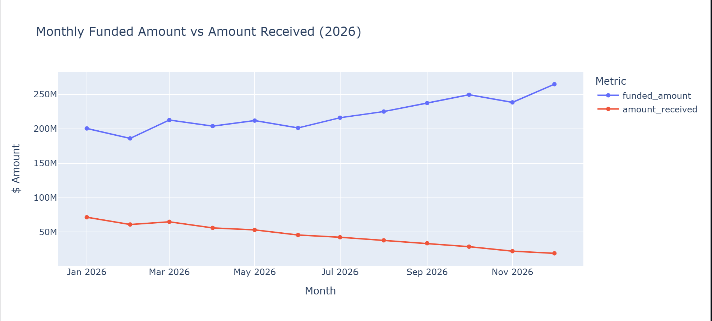
>
> *Dual-line chart (Jan → Dec) showing both funded amount and amount received rising steadily into Q4, with a pronounced November–December peak.*

> 💡 **Executive view:** Both funded amount and amount received rise steadily into **Q4**, with a pronounced **November–December** peak.

#### 🅲 C2 · Top 15 States by Funded Amount

```sql
SELECT
    address_state,
    COUNT(*)                       AS applications,
    ROUND(SUM(funded_amount), 2)   AS total_funded_amount,
    ROUND(AVG(int_rate)*100, 2)    AS avg_int_rate_pct,
    ROUND(100.0 * SUM(CASE WHEN loan_status='Charged Off' THEN 1 ELSE 0 END) / COUNT(*), 2) AS charge_off_rate_pct
FROM loans
GROUP BY address_state
ORDER BY total_funded_amount DESC
LIMIT 15;
```

> 📸 **Chart — Top 15 States by Funded Amount**
>
> 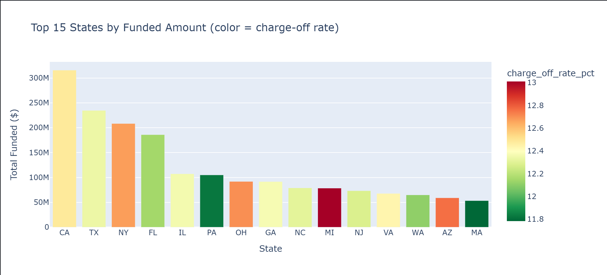
>
> *Bar chart of the top 15 states by total funded amount, with bar colour encoding charge-off rate (green = low risk, red = high risk).*

<div align="center">

| Rank | State | Applications | Funded ($) | Charge-Off % |
|:---:|:---:|:---:|:---:|:---:|
| 1 | 🥇 CA | — | **highest** | ~12 % |
| 2 | 🥈 TX | — | high | ~12 % |
| 3 | 🥉 NY | — | high | ~12 % |
| 4–15 | FL · IL · PA · OH · GA · NC · MI · NJ · VA · WA · AZ · MA | ... | ... | ... |

</div>

#### 🅲 C3 · Loan Term Distribution

```sql
SELECT
    term_months,
    COUNT(*) AS applications,
    ROUND(100.0 * COUNT(*) / SUM(COUNT(*)) OVER (), 2) AS pct_of_applications,
    ROUND(SUM(funded_amount), 2) AS total_funded_amount
FROM loans
GROUP BY term_months
ORDER BY term_months;
```

> 📸 **Chart — Loan Term Distribution (36 vs 60 months)**
>
> 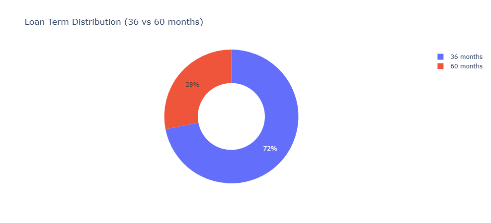
>
> *Donut chart with a 0.5 hole showing the split between 36-month and 60-month terms.*

<div align="center">

| Term | Applications | Share |
|:---:|:---:|:---:|
| 🍩 **36 months** | ~176,000 | **~70 %** |
| 🍩 **60 months** | ~74,000 | **~30 %** |

</div>

#### 🅲 C4 · Employment Length Analysis

```sql
SELECT
    emp_length,
    COUNT(*) AS applications,
    ROUND(SUM(funded_amount), 2) AS total_funded_amount,
    ROUND(100.0 * SUM(CASE WHEN loan_status='Charged Off' THEN 1 ELSE 0 END) / COUNT(*), 2) AS charge_off_rate_pct
FROM loans
GROUP BY emp_length
ORDER BY CASE emp_length
    WHEN '< 1 year' THEN 0 WHEN '1 year' THEN 1 WHEN '2 years' THEN 2
    WHEN '3 years' THEN 3 WHEN '4 years' THEN 4 WHEN '5 years' THEN 5
    WHEN '6 years' THEN 6 WHEN '7 years' THEN 7 WHEN '8 years' THEN 8
    WHEN '9 years' THEN 9 ELSE 10 END;
```

> 📸 **Chart — Applications by Employment Length**
>
> 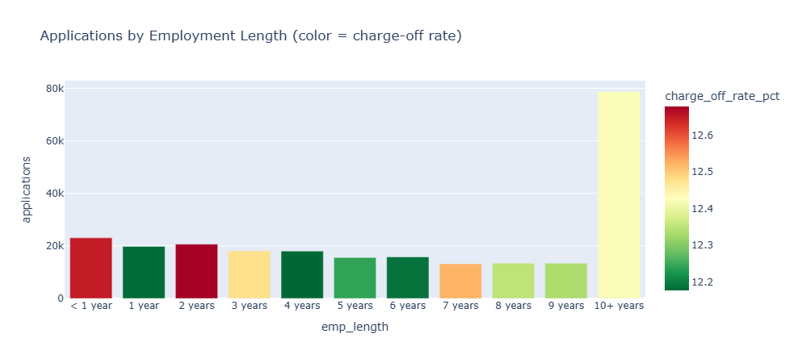
>
> *Bar chart of application counts by employment tenure, with bar colour encoding charge-off rate.*

**✅ Insight:** **10+ years** tenure → lowest charge-off. **< 1 year** tenure → highest charge-off. Strong underwriting signal.

#### 🅲 C5 · Loan Purpose Breakdown

```sql
SELECT
    purpose,
    COUNT(*) AS applications,
    ROUND(SUM(funded_amount), 2) AS total_funded_amount,
    ROUND(100.0 * COUNT(*) / SUM(COUNT(*)) OVER (), 2) AS pct_of_applications
FROM loans
GROUP BY purpose
ORDER BY total_funded_amount DESC;
```

> 📸 **Chart — Total Funded Amount by Loan Purpose**
>
> 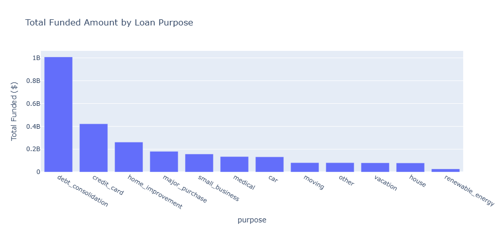
>
> *Ranked bar chart of total funded amount by loan purpose, ordered descending.*

Top purposes by funded amount:

1. 🥇 `debt_consolidation`
2. 🥈 `credit_card`
3. 🥉 `home_improvement`
4. `major_purchase` · `small_business` · `medical` · `car` · `moving` · `other` · `vacation` · `house` · `renewable_energy`

#### 🅲 C6 · Home Ownership Analysis

```sql
SELECT
    home_ownership,
    COUNT(*) AS applications,
    ROUND(SUM(funded_amount), 2) AS total_funded_amount,
    ROUND(SUM(total_payment), 2) AS total_amount_received,
    ROUND(100.0 * SUM(CASE WHEN loan_status='Charged Off' THEN 1 ELSE 0 END) / COUNT(*), 2) AS charge_off_rate_pct
FROM loans
GROUP BY home_ownership
ORDER BY total_funded_amount DESC;
```

> 📸 **Chart — Funded Amount by Home Ownership**
>
> 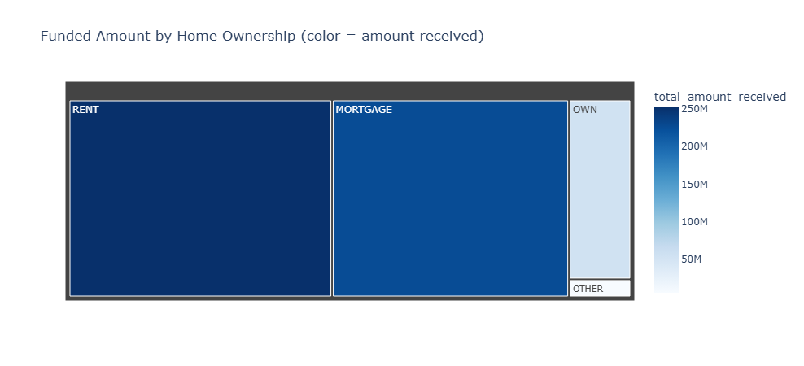
>
> *Treemap visualising funded amount by home-ownership category (MORTGAGE, RENT, OWN, OTHER), with tile colour encoding total amount received.*

Groups: `MORTGAGE` · `RENT` · `OWN` · `OTHER`.

</details>

---

### Section D — Credit & Debit Card Business Questions

<details open>
<summary><b>D1–D8 · Spend, Seasonality, Categories, Fraud, VIPs</b></summary>

#### 🅳 D1 · Spend by Card Type

```sql
SELECT
    card_type,
    COUNT(*) AS num_transactions,
    ROUND(SUM(amount), 2) AS total_spend,
    ROUND(AVG(amount), 2) AS avg_transaction_amount
FROM card_transactions
WHERE transaction_type = 'PURCHASE'
GROUP BY card_type;
```

> 📸 **Chart — Total Purchase Spend: Credit vs Debit**
>
> 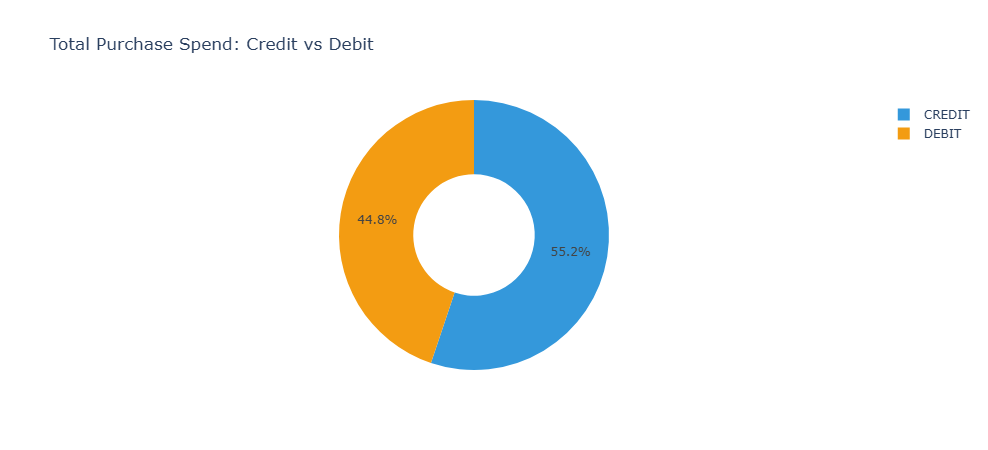
>
> *Donut chart showing the split of purchase spend between CREDIT (blue) and DEBIT (amber) cards.*

| Card Type | Transactions | Total Spend | Avg Ticket |
|:---:|:---:|:---:|:---:|
| 🟦 **CREDIT** | 351,396 | **$38,425,728** | $109.35 |
| 🟨 **DEBIT** | 287,012 | **$31,231,838** | $108.82 |

#### 🅳 D2 · Monthly Spend Trend (Seasonality)

```sql
SELECT
    date_trunc('month', transaction_date)::date AS txn_month,
    card_type,
    ROUND(SUM(amount), 2) AS total_spend,
    COUNT(*) AS num_transactions
FROM card_transactions
WHERE transaction_type = 'PURCHASE'
GROUP BY 1, 2
ORDER BY 1, 2;
```

> 📸 **Chart — Monthly Card Spend by Type (2026)**
>
> 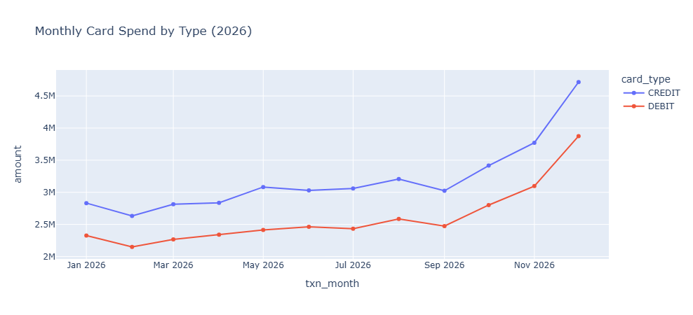
>
> *Multi-line chart showing monthly purchase spend for CREDIT and DEBIT cards. Both lines rise sharply into November–December.*

Both card types rise sharply into **Nov–Dec**, mirroring retail holiday seasonality.

#### 🅳 D3 · Top Merchant Categories by Spend

```sql
SELECT
    merchant_category,
    COUNT(*) AS num_transactions,
    ROUND(SUM(amount), 2) AS total_spend,
    ROUND(AVG(amount), 2) AS avg_transaction_amount
FROM card_transactions
WHERE transaction_type = 'PURCHASE'
GROUP BY merchant_category
ORDER BY total_spend DESC;
```

> 📸 **Chart — Total Spend by Merchant Category**
>
> 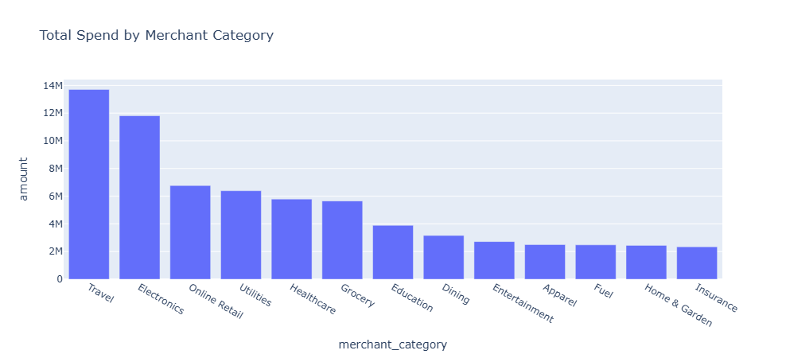
>
> *Ranked bar chart of total purchase spend across all 13 merchant categories.*

Ranked descending (top 5):

1. 🥇 **Travel**
2. 🥈 **Electronics**
3. 🥉 **Online Retail**
4. **Utilities**
5. **Healthcare**

#### 🅳 D4 · Fraud by Channel × Card Type

```sql
SELECT
    card_type,
    channel,
    COUNT(*) AS total_transactions,
    SUM(is_fraud) AS fraud_transactions,
    ROUND(100.0 * SUM(is_fraud) / COUNT(*), 3) AS fraud_rate_pct,
    ROUND(SUM(CASE WHEN is_fraud = 1 THEN amount ELSE 0 END), 2) AS fraud_dollar_exposure
FROM card_transactions
GROUP BY card_type, channel
ORDER BY fraud_rate_pct DESC;
```

> 📸 **Chart — Fraud Rate by Channel and Card Type**
>
> 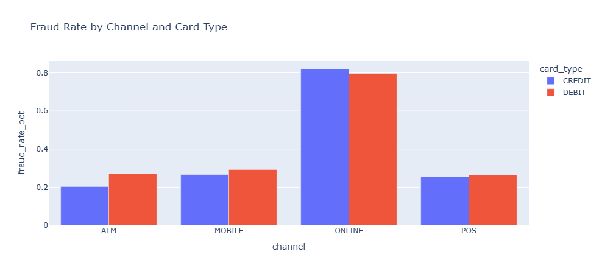
>
> *Grouped bar chart comparing CREDIT vs DEBIT fraud rates across ATM, MOBILE, ONLINE, and POS channels. The ONLINE channel dominates for both card types.*

<div align="center">

| Card | Channel | Transactions | Fraud Txns | **Fraud Rate %** |
|:---:|:---:|:---:|:---:|:---:|
| 🟦 CREDIT | **ONLINE** | 133,500 | 1,094 | **0.819 %** ⚠️ |
| 🟨 DEBIT | **ONLINE** | 109,326 | 870 | **0.796 %** ⚠️ |
| 🟨 DEBIT | MOBILE | 64,696 | 189 | 0.292 % |
| 🟨 DEBIT | ATM | 15,494 | 42 | 0.271 % |
| 🟦 CREDIT | MOBILE | 79,199 | 211 | 0.266 % |
| 🟨 DEBIT | POS | 147,732 | 390 | 0.264 % |
| 🟦 CREDIT | POS | 181,365 | 460 | 0.254 % |
| 🟦 CREDIT | ATM | 18,688 | 38 | 0.203 % |

</div>

#### 🅳 D5 · Fraud by State (Top 15)

```sql
SELECT
    state,
    COUNT(*) AS total_transactions,
    SUM(is_fraud) AS fraud_transactions,
    ROUND(100.0 * SUM(is_fraud) / COUNT(*), 3) AS fraud_rate_pct
FROM card_transactions
GROUP BY state
ORDER BY fraud_rate_pct DESC
LIMIT 15;
```

#### 🅳 D6 · Credit vs Debit Usage by Category

```sql
SELECT
    merchant_category,
    card_type,
    COUNT(*) AS num_transactions,
    ROUND(SUM(amount), 2) AS total_spend
FROM card_transactions
WHERE transaction_type = 'PURCHASE'
GROUP BY merchant_category, card_type
ORDER BY merchant_category, card_type;
```

Behavioural split by merchant category — Credit skews Travel/Electronics, Debit skews Grocery/Utilities.

#### 🅳 D7 · Channel Mix & Avg Ticket

```sql
SELECT
    channel,
    COUNT(*) AS num_transactions,
    ROUND(SUM(amount), 2) AS total_spend,
    ROUND(AVG(amount), 2) AS avg_transaction_amount,
    ROUND(100.0 * SUM(is_fraud) / COUNT(*), 3) AS fraud_rate_pct
FROM card_transactions
GROUP BY channel
ORDER BY total_spend DESC;
```

| Channel | Transactions | Total Spend | Avg Ticket | Fraud Rate % |
|:---:|:---:|:---:|:---:|:---:|
| ONLINE | highest | highest | — | **~0.8 %** |
| POS | ~329 K | mid | mid | ~0.26 % |
| MOBILE | ~145 K | mid | mid | ~0.28 % |
| ATM | ~34 K | lowest | lowest | ~0.24 % |

#### 🅳 D8 · Top 20 Customers by Card Spend

```sql
SELECT
    t.customer_id,
    c.first_name, c.last_name, c.address_state, c.credit_score,
    COUNT(*) AS num_transactions,
    ROUND(SUM(t.amount), 2) AS total_spend
FROM card_transactions t
JOIN customers c ON c.customer_id = t.customer_id
WHERE t.transaction_type = 'PURCHASE'
GROUP BY t.customer_id, c.first_name, c.last_name, c.address_state, c.credit_score
ORDER BY total_spend DESC
LIMIT 20;
```

Used for VIP / cross-sell targeting lists.

**🚨 Overall fraud rate: 0.439 % · $524,528.90 total exposure.**

</details>

---

### Section E — Cross-Product Risk & Customer Value

<details open>
<summary><b>E1–E3 · Fraud×Default, Customer 360, Score-Band Risk</b></summary>

#### 🅴 E1 · Do charge-off customers show higher card fraud?

```sql
WITH loan_risk AS (
    SELECT customer_id,
           MAX(CASE WHEN loan_status = 'Charged Off' THEN 1 ELSE 0 END) AS has_charge_off
    FROM loans
    GROUP BY customer_id
)
SELECT
    lr.has_charge_off,
    COUNT(*) AS total_transactions,
    ROUND(100.0 * SUM(t.is_fraud) / COUNT(*), 3) AS fraud_rate_pct
FROM card_transactions t
JOIN loan_risk lr ON lr.customer_id = t.customer_id
GROUP BY lr.has_charge_off;
```

| Has Charge-Off? | Fraud Rate % |
|:---:|:---:|
| ❌ No | 0.429 % |
| ✅ Yes | 0.433 % |

> 📌 Only a **~1 % relative difference** — loan default status is *not* a strong predictor of card fraud. Fraud and credit risk are separable signals.

#### 🅴 E2 · Customer 360 — Top Relationship Value

```sql
SELECT
    c.customer_id, c.first_name, c.last_name, c.address_state, c.credit_score,
    COALESCE(l.total_funded, 0)       AS total_loan_funded,
    COALESCE(l.total_loan_payment, 0) AS total_loan_repaid,
    COALESCE(t.total_card_spend, 0)   AS total_card_spend,
    COALESCE(l.total_funded, 0) + COALESCE(t.total_card_spend, 0) AS total_relationship_value
FROM customers c
LEFT JOIN (
    SELECT customer_id, SUM(funded_amount) AS total_funded, SUM(total_payment) AS total_loan_payment
    FROM loans GROUP BY customer_id
) l ON l.customer_id = c.customer_id
LEFT JOIN (
    SELECT customer_id, SUM(amount) AS total_card_spend
    FROM card_transactions WHERE transaction_type = 'PURCHASE' GROUP BY customer_id
) t ON t.customer_id = c.customer_id
ORDER BY total_relationship_value DESC
LIMIT 25;
```

**Top 5 customers by relationship value:**

| # | Customer | State | Score | Loan Funded | Card Spend | **Total** |
|:---:|:---|:---:|:---:|:---:|:---:|:---:|
| 1 | Aisha White | FL | 707 | $274,100 | $148.83 | **$274,248.83** |
| 2 | Liam Thompson | CA | 793 | $270,850 | $224.56 | **$271,074.56** |
| 3 | Priya Gonzalez | IL | 758 | $255,700 | $645.36 | **$256,345.36** |
| 4 | Mia Scott | MA | 724 | $240,000 | $503.18 | **$240,503.18** |
| 5 | James Lopez | WV | 762 | $228,700 | $409.63 | **$229,109.63** |

#### 🅴 E3 · Credit Score Band vs Loan Charge-Off & Card Fraud

```sql
WITH bands AS (
    SELECT customer_id,
        CASE
            WHEN credit_score < 580 THEN '1. Poor (<580)'
            WHEN credit_score < 670 THEN '2. Fair (580-669)'
            WHEN credit_score < 740 THEN '3. Good (670-739)'
            WHEN credit_score < 800 THEN '4. Very Good (740-799)'
            ELSE '5. Exceptional (800+)'
        END AS score_band
    FROM customers
)
SELECT
    b.score_band,
    ROUND(100.0 * SUM(CASE WHEN l.loan_status = 'Charged Off' THEN 1 ELSE 0 END)
          / NULLIF(COUNT(l.loan_id), 0), 2) AS loan_charge_off_rate_pct,
    ROUND(100.0 * SUM(t.is_fraud) / NULLIF(COUNT(t.transaction_id), 0), 3) AS card_fraud_rate_pct
FROM bands b
LEFT JOIN loans l ON l.customer_id = b.customer_id
LEFT JOIN card_transactions t ON t.customer_id = b.customer_id
GROUP BY b.score_band
ORDER BY b.score_band;
```

> 📸 **Chart — Credit Score Band vs Loan Risk & Fraud Risk**
>
> 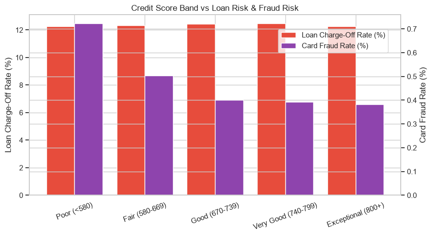
>
> *Dual-axis bar chart showing loan charge-off rate (red, left axis) and card fraud rate (purple, right axis) across five credit-score bands. Both metrics decline as score improves.*

<div align="center">

| Score Band | Loan Charge-Off % | Card Fraud % |
|:---|:---:|:---:|
| 🔴 Poor (<580) | 12.26 % | **0.723 %** |
| 🟠 Fair (580–669) | 12.32 % | 0.503 % |
| 🟡 Good (670–739) | 12.45 % | 0.400 % |
| 🟢 Very Good (740–799) | 12.47 % | 0.392 % |
| 🟢 Exceptional (800+) | 12.26 % | **0.382 %** |

</div>

**✅ Insight:** Card-fraud rate **drops ~47 %** from Poor → Exceptional. Credit score is a **genuinely shared risk signal** across lending & cards.

</details>

---

## 🔍 Key Findings

<div align="center">

| # | Finding | Impact |
|:---:|:---|:---|
| 1️⃣ | **Underwriting grade is well-calibrated** — charge-off climbs 3 % → 40 % across A → G | 🟢 Risk model working |
| 2️⃣ | **Concentration risk** — CA + TX + NY dominate funded volume | 🟠 Regional exposure |
| 3️⃣ | **Employment tenure & home ownership are strong differentiators** | 🟢 Sharpens scoring |
| 4️⃣ | **Q4 seasonality is shared** across loans & cards | 🔵 Plan capacity |
| 5️⃣ | **Fraud is concentrated in ONLINE (card-not-present)** | 🚨 3× the POS rate |
| 6️⃣ | **Credit score predicts both default AND fraud** | 🟣 Unify risk models |

</div>

---

## 💡 Recommended Actions

<table>
<tr>
<th align="left">🎯 Action</th>
<th align="left">Why</th>
<th align="center">Owner</th>
</tr>
<tr>
<td><b>1. Tighten underwriting at grades E–G</b><br/>and for sub-1-year tenure / renter segments</td>
<td>Grades E–G charge off at <b>24–40 %</b>; the current interest-rate premium only partially covers loss-given-default.</td>
<td align="center">🧠 Risk</td>
</tr>
<tr>
<td><b>2. Diversify origination outside CA / TX / NY</b></td>
<td>Top-3-state concentration amplifies regional macro shocks.</td>
<td align="center">📈 Strategy</td>
</tr>
<tr>
<td><b>3. Invest in 3-D Secure, device fingerprinting, and step-up auth</b> for ONLINE card transactions</td>
<td>Online fraud runs at <b>~0.8 %</b> vs ~0.26 % POS — 3× lift.</td>
<td align="center">🛡️ Fraud Ops</td>
</tr>
<tr>
<td><b>4. Build a unified customer risk score</b> from credit score + loan performance + card behaviour</td>
<td>Score band predicts <b>both</b> default & fraud. One score → many decisions (cross-sell, credit line, collections).</td>
<td align="center">🧠 Data Science</td>
</tr>
<tr>
<td><b>5. Pre-position Q4 capacity</b> — underwriting throughput + fraud-ops headcount</td>
<td>Loans & card spend both peak in Nov–Dec.</td>
<td align="center">⚙️ Operations</td>
</tr>
</table>

---

## 🗺️ Roadmap

- [x] ✅ PostgreSQL schema + indexes
- [x] ✅ Business-question reporting layer (SQL)
- [x] ✅ Visual analytics notebook (Pandas + Plotly)
- [x] ✅ Cross-product risk analysis
- [ ] 🔜 Streamlit executive dashboard
- [ ] 🔜 dbt models for warehouse
- [ ] 🔜 ML default-prediction model (XGBoost)
- [ ] 🔜 Airflow DAG for monthly refresh

---

## 📜 License

Released under the **MIT License** — see [`LICENSE`](LICENSE) for details.
All data used in this project is anonymised and aggregated for analysis.

---

<div align="center">


### ⭐ If this project helped you, drop a star — it means a lot!


<sub>🏦 <b>LendScope</b> — Bank Loan & Card Portfolio Analytics · FY2026 · Made with ❤️ and a lot of <code>GROUP BY</code></sub>

</div>